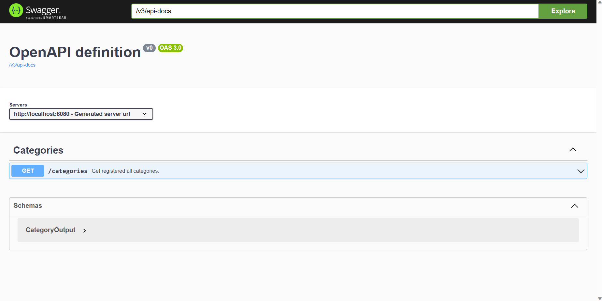
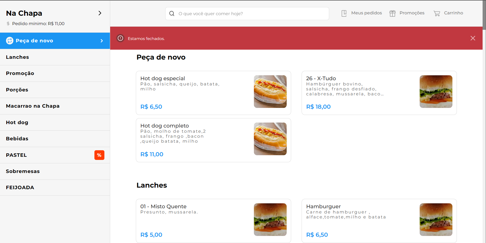

<h1 align="center">Guto Delivery</h1>

## 🧪 Technologies

This project was developed by using the following technologies:

* Java
* Spring Boot
* Maven
* Lombok
* Model Mapper
* Springdoc
* Flyway
* Docker Compose

## ✅ Prerequisites
* Java 17
* Docker

## 🚀 How to use
First clone this project:
```bash
gh repo clone gutemberg-jhonata/gutodelivery-api
```
Then start the database with the following command:
```bash
docker compose up -d
```
At last start the application:
```bash
./mvnw package
java -jar target/gutinhoanotaai-0.0.1-SNAPSHOT.war
```

## 📖 Documentation
The documentation is avaliable by accessing the /docs endpoint. 👇 
<p align="center">
  
</p>

## 🚨 Patterns and Architecture?

### Architecture
* This project employes the Clean Arquitecture. So make sure you are following the Clean Architecture structure an concepts.
<p align="center">
  
</p>

### Commit Pattern
* This project employes the Conventional Commits specification. You can take a look by this current link: https://www.conventionalcommits.org/en/v1.0.0/

* Make sure you have setup your local Git Hooks:
```bash
chmod +x .githooks/commit-msg
git config core.hooksPath .githooks
```

## 💻 About

This project is a backend clone base on https://pedido.anota.ai/. 👇

<p align="center">
  
</p>
