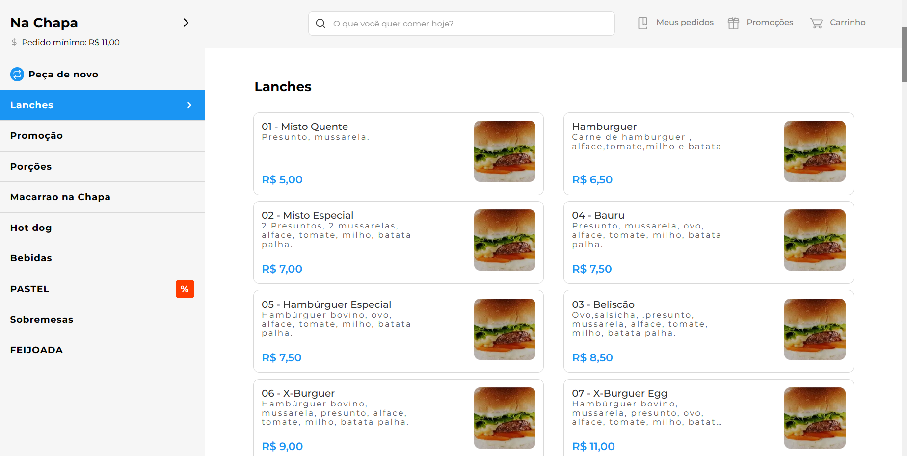

<h1 align="center">Guto Delivery</h1>

## 🧪 Technologies

This project was developed by using the following technologies:

* Java
* Spring Boot
* Maven
* Lombok
* Model Mapper
* Springdoc
* Flyway
* Docker Compose
* Editorconfig

## ✅ Prerequisites
* Java 17
* Docker

## 🚀 How to use
First clone this project:
```bash
gh repo clone gutemberg-jhonata/gutodelivery-api
```
Then start the database with the following command:
```bash
docker compose up -d
```
At last start the application:
```bash
./mvnw package
java -jar target/gutinhoanotaai-0.0.1-SNAPSHOT.war
```

## 📖 Documentation
The documentation is avaliable by accessing the /docs endpoint. 👇
<p align="center">
  
</p>

## 🚨 Patterns and Architecture?

### TDD
* The development of this projects was oriented by tests. You can execute the tests with the following command:
```bash
./mvnw test
```

### DDD
* The entities of this project are oriented by the Domain Driven Design concepts.

### Architecture
* This project employes the Clean Arquitecture. So make sure you are following the Clean Architecture structure and concepts.
<p align="center">
  
</p>

### Commit Pattern
* This project employes the Conventional Commits specification. You can take a look by this current link: https://www.conventionalcommits.org/en/v1.0.0/

* Make sure you have setup your local Git Hooks:
```bash
chmod +x .githooks/commit-msg
git config core.hooksPath .githooks
```

### Coding Styles
* For help to maintain the coding styles on this project was used EditorConfig. Make sure you have installed EditorConfig plugin on your IDE.
https://editorconfig.org/

## 💻 About

This project is a backend clone base on https://pedido.anota.ai/. 👇

<p align="center">
  
</p>
